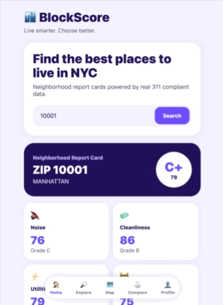

<div align="center">


<br />



<br />

</div>

---

## Author

Jacqueline Delgado
GitHub: [YOUR-PROFILE-LINK](https://github.com/jdbostonbu-ops)

Repository: [YOUR-REPO-LINK](https://blockscore.onrender.com)

## About

BlockScore is a full-stack mobile app that helps people choose where to live in New York City. Enter a ZIP code and get a Neighborhood Report Card — an overall letter grade plus category scores for noise, cleanliness, utilities, and infrastructure — all calculated from real NYC 311 service-request data.

## Features

- Search any NYC ZIP code for an instant neighborhood report card
- Overall livability grade (A–F) with a 0–100 score
- Category breakdowns: noise, cleanliness, utilities, infrastructure
- Top complaint types ranked with visual bars
- Built on real NYC 311 complaint data

## Tech Stack

**Frontend**
- React Native (Expo)
- JavaScript
- Axios for API requests

**Backend**
- Python
- FastAPI
- SQLite

**Data**
- NYC Open Data — 311 Service Requests

## Getting Started

### Prerequisites
- Python 3
- Node.js and npm
- Expo CLI

### Run the backend

```bash
cd backend
pip install -r requirements.txt
uvicorn main:app --reload
```

The API runs at `http://127.0.0.1:8000`. View the interactive docs at `http://127.0.0.1:8000/docs`.

### Run the mobile app

```bash
cd mobile
npm install
npx expo start
```

Press `w` to open the app in a web browser, or scan the QR code with the Expo Go app.

## API Endpoints

| Method | Endpoint | Description |
|--------|----------|-------------|
| GET | `/health` | Health check |
| GET | `/complaints/top` | Top complaint types |
| GET | `/complaints/electric` | Electric complaint breakdown |
| GET | `/neighborhoods/search` | Search a ZIP code |
| GET | `/neighborhoods/report-card/{zip_code}` | Neighborhood report card |
| GET | `/noise/peak-hours/{zip_code}` | Peak noise hours |
| GET | `/rankings/quietest` | Quietest neighborhoods |
| GET | `/rankings/cleanest` | Cleanest neighborhoods |

## Project Status

BlockScore is a working prototype. The backend, database, and core mobile screens are functional and connected end to end. It currently runs locally for development.

